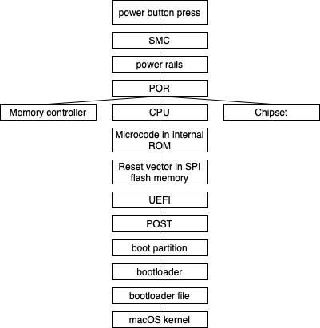
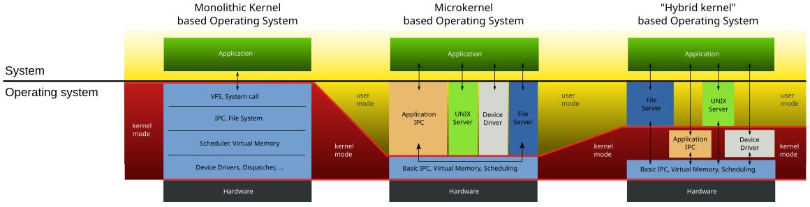

# What is  happening while pressing the power button

When the power button is pressed, the following events take place:

1. Mechanical Action:

    1. The __power button__ is a momentary push-button switch. It is a _soft_ one, because it has the same color when computer is on and off. 
    2. Pressing the button mechanically closes the contacts inside the switch, which is normally open when the computer is off. It provides electricity to the main components of computer. 

2. Electrical Circuit Closure:

    1. The closure of the switch closes an electrical circuit on the motherboard.
    2. This circuit is connected to a __General-Purpose Input/Output (GPIO) pin__, which is used to detect the power button press, on the __System Management Controller (SMC)__, which is a specialized microcontroller responsible for managing power functions.   
    GPIO pins can be configured as input or output pins. In this case, the pin is configured as an _input_ to detect the state of the power button.    

        GPIO pins are typically configured with a _pull-up resistor_. It ensures that the GPIO pin is held at a _high voltage level (logical 1)_ when the button is not pressed.
    

        When the power button is pressed, it creates a direct electrical connection between the GPIO pin and ground (0V). This connection overrides the pull-up resistor’s voltage, pulling the GPIO pin’s voltage down to ground (0V). The GPIO pin changes to a _low voltage level (logical 0)_, which the System Management Controller (SMC) detects as a signal to initiate the power-up sequence.

3. Debouncing:

    Switches can generate noise due to bouncing (rapid on/off states) when they are pressed.
    The circuit includes a debouncing mechanism (for my laptop it is a debouncing circuit within the SMC) to filter out noise and produce a clean signal. 

4. SMC/PMU Signal Reception:

    The clean signal, which is typically low voltage one, from the debounced switch indicates to the SMC that the power button has been pressed.

5. Power rails:

    The SMC activates __power rails__, which are specific voltage lines that provide power to different components. This involves enabling the __power management integrated circuits (PMICs)__, which manage the distribution and regulation of power across the motherboard, and __voltage regulation modules (VRM)__, which convert and regulate the voltage from the power supply (a battery in this case) to the appropriate levels required by power rails, to provide stable power to the power rails.   
    
    The PMICs distribute power to VRMs, which further regulate the voltage to precise levels required by different components like the CPU, GPU, RAM, GPU and peripheral devices.  

    The main power rails that need to be stabilized are: 
    1. _Vcore (CPU core voltage)_ - supplies power to the CPU cores. 
    2. _Vmem (memory voltage)_ - supplies power to the RAM. 
    3. _PCH voltage (Platform Controller Hub)_ - supplies power to the chipset, which manages data flow between the CPU, RAM and peripheral devices.
    4. _VGPU (GPU Voltage)_ - supplies power to the Graphics Processing Unit (GPU).
    5. _3.3V, 5V, and 12V rails_ - supplies power to specific parts of the motherboard and peripheral devices.

6. Internal Timers
    
    The SMC includes __internal timers__ that introduce specific delays to ensure that power rails have enough time to stabilize before proceeding.  

    When the power button is pressed, the SMC begins the power-up sequence. It initializes its internal timers to start measuring the required delay intervals.   
    
    __The following steps take place:__
    1. SMC detects the press and starts a debounce timer. After debounce SMC confirms the press and begins the power-up sequence.
    2. SMC activates the first power rail and starts a stabilization timer. The SMC monitors the voltage levels to ensure they are within acceptable ranges before allowing the system to proceed. If stable after delay, it proceeds to the next rail.
    3. SMC activates the second power rail and starts another stabilization timer. This process repeats for each power rail with appropriate delays to ensure stability.
    4. After all power rails are stable, the SMC starts a final timer. Once this timer expires, the SMC generates the Power-on Reset (POR) signal, and the system begins the initialization and boot process.
 
7. Power-on Reset (POR)

    The __POR__ signal is a specific pulse or series of pulses that reset all major components of the system, including the CPU, GPU, RAM, and peripheral devices. The POR signal is distributed via __dedicated reset lines__, which are specific electrical pathways on the motherboard that carry POR signals to the CPU, chipset, memory controller, and other critical components. Each component receives the POR signal and is reset to its initial default settings, becomes ready for initialization.
    
    __Types of Reset Lines:__

    * _Global Reset Line_ - carries the main POR signal generated by the SMC to all components.
    * _Component-Specific Reset Lines_ - carries POR signal to specific critical component to ensure precise control over its initialization.
    
    __Why the POR signal is needed:__

    * The POR signal ensures that all components start their initialization routines simultaneously and in a coordinated manner. 
    * The POR signal resets all critical components to prevent any undefined or unpredictable behaviors.
    * When power is first applied, there can be voltage fluctuations and noise that can cause components to enter unpredictable states. The POR signal helps to mask these initial glitches.
    * Without a POR signal different components might power up at different times, leading to timing issues. Some components may be ready and begin functioning before others, causing communication errors and system instability.
    * Components like CPUs, memory controllers, and peripheral interfaces have complex internal states. Directly applying power does not guarantee that these states will initialize correctly. Residual charge or noise could leave these components in undefined states, leading to erratic behavior or system crashes.
    * The POR signal allows for a controlled sequencing of power-up steps. Multiple power rails need to be activated in a specific order. 

    __The following steps take place:__

    1. The POR signal travels through the global reset line and branches into component-specific reset lines. Each critical component receives the POR signal almost simultaneously for synchronized initialization.

    2. The CPU receives the POR signal, clears its registers and prepares to execute instructions from its internal ROM.

        __Internal ROM (Read-Only Memory) within the CPU__ is a non-volatile memory area that stores essential microcode and initialization instructions. The internal ROM contains the default microcode that the CPU uses for basic operations and initialization. 

        __Microcode__ is a layer of low-level instructions that implement higher-level machine code instructions in a CPU. It is an intermediary between the hardware and the software, breaks down complex instructions into simpler operations that the hardware can execute.

        After executing the initial microcode from the internal ROM the CPU is in a state where it can start interacting with external components - the __SPI flash memory__.
    
        __SPI Flash Memory__ is a type of non-volatile storage that uses the __Serial Peripheral Interface (SPI)__, which is a standard for synchronous serial communication, bus for communication.

        The CPU then executes firmware instructions from the __reset vector__, which is a specific address in the SPI flash memory, as part of the UEFI firmware initialization process.

    3. The chipset, which includes the Platform Controller Hub (PCH), also receives the POR signal and begins initializing its interfaces and controllers. Peripheral devices like USB controllers, audio controllers, and network interfaces are reset and start their initialization routines.

    4. The memory controller receives the POR signal and starts the initialization process for the RAM. This includes configuring the memory timings and testing the memory modules, which is mostly done by different read/write operations.

        Configuring the memory timings:
     
        __Serial Presence Detect (SPD)__ is a standardized method by which memory modules communicate their characteristics to the memory controller. Each memory module contains an __EEPROM (Electrically-Erasable-Programmable Read-Only Memory)__ chip, which is a hybrid memory device that combines features of both RAM and ROM, that stores information such as supported timings, voltage, and capacity. The memory controller uses this information to set timing parameters. Then the memory controller configures these timings.

    When all major components are reset to their initial default settings, the UEFI firmware begins its initialization routines.

8. UEFI

    When the CPU starts executing the UEFI firmware code, the UEFI performs __Power-On Self-Test (POST)__, a series of diagnostic tests to check the basic functionality of the hardware components. The UEFI initializes hardware components and configures them for use.

    1. CPU

        * The CPU starts executing the initial instructions from the UEFI firmware.
        * It sets up its internal state, including registers and caches.
        * Executes self-diagnostic tests to ensure its functional integrity.

    2. Memory 

        * The UEFI firmware configures the memory controller with specific parameters, such as clock speed, timing and voltage settings.
        * The UEFI performs a series of read/write tests on the memory modules to detect any faulty memory cells.

    3. Peripheral devices

        * The UEFI initializes USB controllers to enable support for USB devices connected to the system.
        * The network interfaces (Wi-Fi, Ethernet) are initialized and configured.
        * The audio controller is initialized to enable sound output.

    4. Graphics 

        * The UEFI sets up the initial video output, configuring the display resolution and initializing the frame buffer.
        * The integrated GPU is initialized, including setting up video memory and basic rendering capabilities.

    5. Storage Device Detection

        * The UEFI detects storage devices, initializes their controllers, and prepares them for booting the operating system.

9. Boot process

    After the successful POST completion UEFI checks the __boot order__ configured in its settings. This order specifies the sequence of devices that UEFI will check for a bootable OS. This includes internal storage (like an SSD), external USB drives, and network boot options. UEFI scans each device in the configured order for a __boot partition__, which is a volume of the computer that contains the system files used to start the operating system. In my case the primary internal storage device is the NVMe SSD.

    An __NVMe SSD (Non-Volatile Memory Express Solid State Drive)__ is a type of SSD that uses the NVMe protocol to communicate with the computer.
    
    __NVMe (Non-Volatile Memory Express)__ is a protocol designed to use the PCIe bus to connect SSD storage to CPUs. 
    
    __Peripheral Component Interconnect Express (PCIe)__ is a high-speed interface standard designed for connecting various hardware components (SSDs for example) to a computer's motherboard. 

    UEFI uses various protocols defined by the UEFI specification to interact with hardware and perform tasks such as file reading.

    * UEFI initializes the Block I/O Protocol to communicate with the NVMe SSD at the block level.

    * The Simple File System Protocol provides the necessary interfaces to navigate and read files from supported filesystems, like FAT32. 

    __FAT32__ is the 32-bit version of the file allocation table (FAT) file system.

    When a bootable device is found, UEFI looks for the bootloader. The __bootloader__ is a small program that loads the operating system. The bootloader is stored on a special boot partition, such as GUID (Globally Unique IDentifier) Partition Table (GPT).

    The __GUID Partition Table (GPT)__ is a standard for the layout of partition tables of a SSD, using globally unique identifiers (GUIDs). 
    
    A __partition table__ is a table maintained on a disk by the operating system that outlines and describes the partitions on that disk.
    
    __GUID__ is a 128-bit label used for information in computer systems.
    
    GPT stores boot information across multiple sectors.    

    UEFI reads the boot information from the GPT, which points to the bootloader file, located in the EFI system partition (ESP). 

    The __EFI system partition (ESP)__ is a partition (in my case) on a NVMe SSD that is used by computers that have UEFI. An ESP contains a bootloader file, device driver files for hardware devices present in a computer and used by the UEFI at boot time, system utility programs that are intended to be run before an operating system is booted and data files such as error logs.
    The Simple File System Protocol mounts the ESP, so that its contents are aaccessible to UEFI. UEFI navigates the directory, locating the EFI/APPLE/boot.efi file - a bootloader file.

    The firmware uses the Simple File System Protocol to read the contents of boot.efi, transferring the binary data into a designated area of RAM, reserved for boot operations, so that it doesn't conflict with other memory areas reserved for different purposes. UEFI prepares the system to execute the boot.efi file by setting up necessary memory address spaces and system services. This file is responsible for verification and loading of the operating system kernel.

10. Kernel loading:

    1. boot.efi ensures the CPU is in the correct operating mode, configures essential CPU registers, initializes memory controllers and sets up memory management structures.

    2. initializes necessary peripherals and I/O devices required for the boot process, ensures that essential components such as the display, keyboard, and storage devices are ready for use.
    3. performs cryptographic checks to verify the integrity of the macOS kernel. Ensures that the kernel has not been tampered with and is signed by Apple.
    4. utilizes Apple's Secure Boot process to ensure that only trusted software components are executed. Verifies the digital signature of the kernel and other critical boot components.
    5. locates the macOS kernel file on the system volume. The kernel file is typically named __mach_kernel__. The file resides on the APFS (Apple File System) formatted volume, which is the primary filesystem for macOS.
    6. reads the kernel file from the APFS volume into a specific region of system memory. Uses filesystem protocols to navigate the APFS structure and access the kernel file.
    7. sets up data structures that the kernel will use during its execution, prepares the boot arguments and environment variables that need to be passed to the kernel.
    8. loads kernel extensions (kexts) required for the kernel to interface with hardware. These extensions provide drivers and additional functionality needed during the early stages of kernel execution.
    9. configures the system memory map, detailing the layout of RAM regions and their purposes. Ensures that the kernel has a clear understanding of the available RAM and its allocation.
    10. performs any final preparations needed before transferring control to the kernel. Ensures that all necessary components and data are correctly loaded and configured.
    11. transfers control to the entry point of the macOS kernel. This is a specific address in RAM where the kernel begins execution. The jump involves updating the CPU instruction pointer to the kernel’s starting address.

## Diagram

11. MacOS kernel

    The __kernel__ is the part of an operating system that loads first.

    __XNU__ ("X is Not Unix") is the computer operating system (OS) kernel developed for use in the macOS operating system.

    XNU is a hybrid kernel, containing features of both monolithic kernels and microkernels.

    A __monolithic kernel__ is an operating system architecture with the entire operating system running in kernel space. Monolithic architecture kernel examples: Unix (including Linux), MS-DOS, Windows 9x.
    
    __MS-DOS (Microsoft Disk Operating System)__ is an operating system for x86-based personal computers mostly developed by Microsoft.

    __Microkernel__ is the near-minimum amount of software that can provide the mechanisms needed to implement an operating system. 

    

    Parts of XNU:
    * code from an old computer architecture system called _Mach_. This code is responsible for some basic functions within the Mac computer, including virtual memory management and multitasking. The code also gives the Mac OS the authority to reduce the CPU's processing speed should it begin to overheat.
    
    * Input-Output (I/O) Kit. It relies on a specialized, limited version of the C++ programming language to control device drivers. The I/O Kit enables a Mac computer to handle several devices over different technologies at the same time. 
    
    * the Berkeley Software Distribution (BSD) derivative for UNIX. This part of the kernel is in charge of maintaining system securities and permissions. While logging in to a Mac computer the BSD determines the level of access. An administrator would have nearly free access and could download or delete programs and other data. Other user levels might not have these permissions. This lets the administrator define which processes a normal user can and can't access. The BSD element of the XNU kernel also helps synchronize processes in the Mac computer.
    
    * the core services layer and the application services layer. 
    Together with the kernel and hardware, these layers form a stack. 
        1. At the bottom - the hardware and firmware. 
        2. The next level up - macOS kernel. 
        3. Then - the core services layer. It consists of multiple frameworks that allow the computer to process tasks.
        4. Then - the application services layer. It is the basic graphic user interface (GUI) system and also acts as a communications channel between various applications, allowing them to interact.
        5. At the top - the applications. They are computer programs designed to carry out specific tasks other than tasks relating to the operation of the computer itself, typically to be used by end-users. 
